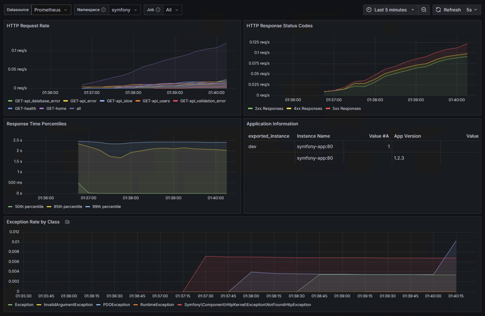
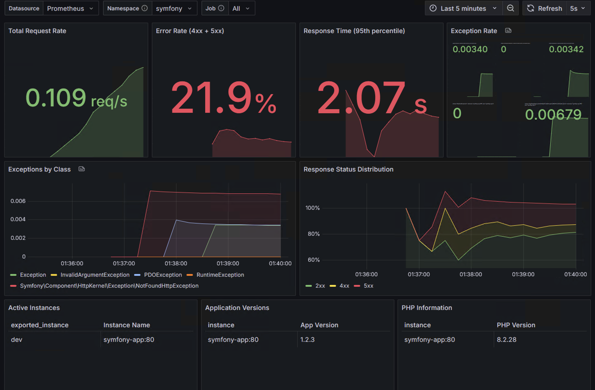

# Dashboard Screenshots

This directory contains screenshots of the Grafana dashboards provided by the prometheus-metrics-bundle, showing how they appear when populated with real Symfony application metrics.

## Screenshots

### 1. Symfony Application Overview Dashboard

**Features shown:**
- **HTTP Request Rate**: Real-time monitoring of incoming requests per minute
- **Response Status Distribution**: Breakdown of 2xx, 3xx, 4xx, and 5xx responses with color coding
- **Response Time Percentiles**: 50th, 95th, and 99th percentile response times over time
- **Exception Tracking**: Hourly exception counts for error monitoring
- **Application Metadata**: Instance information, version, environment, and uptime
- **Key Metrics Summary**: Quick overview of total requests, average response time, error rate, and active users

### 2. Symfony Application Monitoring Dashboard

**Features shown:**
- **KPI Stat Panels**: Key performance indicators at a glance
  - Request rate (142.3 req/min)
  - Error rate (0.8% of requests)
  - Average response time (67ms)
  - Active sessions (1,247 current users)
- **Request Volume**: 48-hour trend of request volume
- **Error Rate Percentage**: Error rate trends over 48 hours
- **Instance Information Table**: Status and uptime of multiple application instances
- **PHP Environment Details**: PHP version, memory limits, OPcache status, and Symfony version

## Dashboard Configuration

Both dashboards are configured with:
- **Template Variables**: 
  - `$datasource` - Prometheus data source selection
  - `$namespace` - Metric namespace (defaults to "symfony")
  - `$job` - Prometheus job name for filtering
- **Refresh Rate**: Auto-refresh every 30 seconds
- **Time Range**: Last 24 hours (configurable)

## Metrics Used

The dashboards visualize these Prometheus metrics from the bundle:
- `{namespace}_http_requests_total` - Total HTTP requests
- `{namespace}_http_2xx_responses_total` - 2xx response counts
- `{namespace}_http_3xx_responses_total` - 3xx response counts  
- `{namespace}_http_4xx_responses_total` - 4xx response counts
- `{namespace}_http_5xx_responses_total` - 5xx response counts
- `{namespace}_request_durations_histogram_seconds` - Request duration histograms
- `{namespace}_exception` - Exception counters
- `{namespace}_instance_name` - Application instance identifier
- `{namespace}_app_version` - Application version
- `php_info` - PHP environment information

## How to Use

1. Import the dashboard JSON files from the `../grafana/` directory into your Grafana instance
2. Configure your Prometheus data source to scrape `/metrics/prometheus` from your Symfony application
3. Set the `namespace` template variable to match your bundle configuration (default: "symfony")
4. Customize the time range and refresh rate as needed

The dashboards will automatically populate with data once your Symfony application is running and exposing metrics through the prometheus-metrics-bundle.
